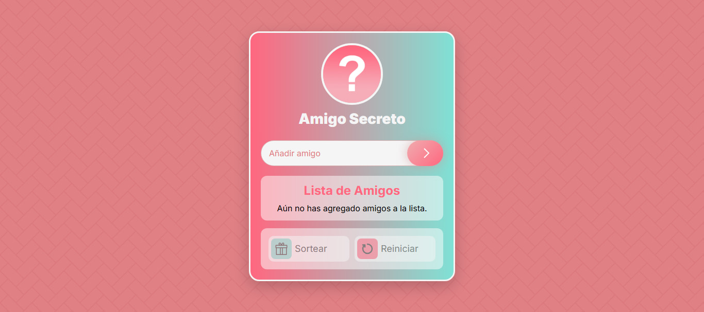

# 🎁 Amigo Secreto

Este es un proyecto interactivo que permite a los usuarios agregar amigos a una lista y realizar un **sorteo aleatorio** para determinar quién será el "amigo secreto". ¡Ideal para juegos y dinámicas de intercambio de regalos!

</img>

### 💻 [Ver en Vivo](https://blackpachamame.github.io/javascript-100-proyectos/05-amigo-secreto/)

## 🎨 Tecnologías utilizadas

- **HTML** → Estructura semántica y accesible.
- **CSS** → Código limpio, organizado y escalable.
- **JavaScript** → Lógica interactiva y manipulaciones del DOM.
- **DiceBear API** → Generación de avatares aleatorios.
- **Confetti.js** → Animaciones de confeti para celebrar el sorteo.

## 🎯 Uso

- **Añadir amigos:** Escribe un nombre y presiona "Añadir" o Enter.
- **Lista animada:** Los amigos agregados aparecen en la lista con un avatar generado aleatoriamente.
- **Sorteo aleatorio:** Se activa cuando hay al menos 2 amigos en la lista.
- **Eliminar amigos:** Puedes quitar amigos de la lista de forma individual.
- **Reiniciar lista:** Borra todos los nombres y reinicia el sorteo.
- **Modo sonido:** Botón para activar o desactivar efectos sonoros.

### 📌 Recursos útiles
- [DiceBear API](https://www.dicebear.com/): Generación de avatares aleatorios.
- [CSS Pattern](https://css-pattern.com/): Background patterns.
- [Confetti](https://confetti.js.org/): Explosiones de confeti.

## 🎁 Contribuciones

¡Las contribuciones son bienvenidas! Si tienes ideas o mejoras, haz un **fork** del repositorio y envía un **pull request**. 💡
