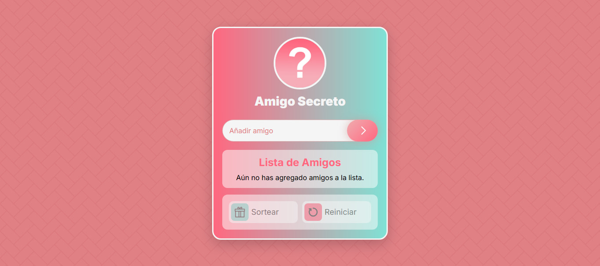

# 🎁 Amigo Secreto

Este es un proyecto interactivo que permite a los usuarios agregar amigos a una lista y realizar un **sorteo aleatorio** para determinar quién será el "amigo secreto". ¡Ideal para juegos y dinámicas de intercambio de regalos!

</img>

### 💻 [Ver en Vivo](https://blackpachamame.github.io/javascript-100-proyectos/05-amigo-secreto/)

## 🎨 Tecnologías utilizadas

- **HTML** → Estructura semántica y accesible.
- **CSS** → Código limpio, organizado y escalable.
- **JavaScript** → Lógica interactiva y manipulaciones del DOM.
- **DiceBear API** → Generación de avatares aleatorios.

## 🎯 Uso

1. **Ingresa los nombres de los participantes** en el campo de texto y presiona "Añadir" o **Enter**.
2. **Los amigos agregados aparecerán en la lista**, junto con un avatar aleatorio.
3. Una vez que haya **al menos 2 amigos**, el botón "Sortear" se habilitará.
4. **Haz clic en "Sortear"** para elegir un amigo secreto y mostrar su avatar.
5. Para reiniciar la lista, presiona **"Reiniciar"**.

### 📌 Estructura del proyecto

```
📂 amigo-secreto
 ├── 📄 index.html      # Página principal
 ├── 🎨 style.css       # Estilos (BEM)
 ├── ⚡ app.js          # Lógica del juego
 ├── 📂 assets         # Imágenes y recursos
 └── 📜 README.md      # Documentación
```

## 🎁 Contribuciones

¡Las contribuciones son bienvenidas! Si tienes ideas o mejoras, haz un **fork** del repositorio y envía un **pull request**. 💡

## 📜 Licencia

Este proyecto está bajo la **Licencia MIT**, lo que significa que puedes usarlo, modificarlo y distribuirlo libremente.
  
**Desarrollado con ❤️ por [el amor de tu vida](https://github.com/Blackpachamame).**
